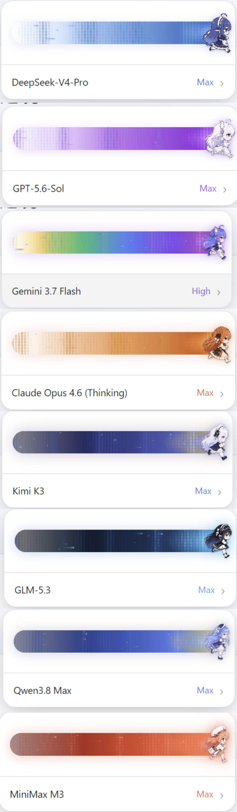

<div align="center">


# dsh-reasoning-effort

**A Codex-style model and reasoning-effort control with 8 dedicated chibi runner animation themes, built directly into DeepSeek Harness.**

[中文说明](README.md) · [GitHub Repository](https://github.com/xihucuyudaichi/dsh-reasoning-effort) · [Original Upstream Project](https://github.com/HanaAyane/dsh-reasoning-effort) · [Report an issue](https://github.com/xihucuyudaichi/dsh-reasoning-effort/issues)

[](https://github.com/xihucuyudaichi/dsh-reasoning-effort/tree/main)
[](https://github.com/deepseek-ai/deepseek-harness)
[](LICENSE)

</div>

---

## 🌟 Upstream Attribution & Acknowledgment

This project is an extended, feature-rich enhancement based on the original work by [HanaAyane/dsh-reasoning-effort](https://github.com/HanaAyane/dsh-reasoning-effort).

Building on the original author's elegant Cordis architecture, reasoning-effort slider, custom provider guidance, and quota monitoring integration, this repository adds:
1. **8 Dedicated Chibi Runner Sprite Themes**: High-precision 2D connected-component valley segmentation ensuring 100% clean, ghosting-free, centered 8-frame running sprite sheets.
2. **Dynamic Dual-Mode Themes & Canvas Radiation FX**: Custom dark/light track gradients, column energy wavebands, hotspots, and streak particle trails tailored for each model family.
3. **Model-First Brand Detection (`detectModelTheme`)**: Prioritizes Model ID & Display Name over Provider identifiers, ensuring seamless theme detection across third-party aggregators (OpenRouter, OneAPI, Bedrock, etc.) and local models.

---

## 🎭 8 Dedicated Model Family Themes

The slider automatically adapts its chibi runner sprite, track theme, and radiation wavebands to the currently selected model in real time:

<div align="center">
  
</div>

| Family | Theme Key | Chibi Runner Character | Dark Mode Track | Light Mode Track | Particle & Glow FX |
| :--- | :--- | :--- | :--- | :--- | :--- |
| **DeepSeek** | `deepseek` | Blue Maid (Classic Fish) | Classic Tech Blue (`#03040a` → `#5d35a0`) | Sky Ice Blue + Tech Blue fill | Blue energy wave & meteor trails |
| **OpenAI / GPT** | `openai` | White Dragon Girl | Codex Neon Purple (`#090412` → `#6b21a8`) | Lilac Violet + Neon Purple fill | Violet starburst particles |
| **Claude** | `claude` | Orange Flower Girl | Anthropic Terracotta (`#120803` → `#c2410c`) | Warm Apricot + Terracotta fill | Terracotta gold aura |
| **Gemini** | `gemini` | Star Catgirl | Google 4-Color Spectrum (`#120902` → `#84184c`) | Lilac Violet + Quad Star fill | 5-color stardust particles |
| **Kimi** | `kimi` | Silver Lunar Maid | Midnight Deep Blue (`#090c1e` → `#4359b8`) | Crystal Blue + Starlight fill | Midnight blue beam + Golden stars |
| **GLM / ZCode** | `glm` | Black-Haired Eyepatch Maid | Obsidian Jet Black (`#05070c` → `#223f66`) | Ice White + Obsidian Cyan fill | Cyber cyan beam + Silver stardust |
| **Qwen / Tongyi** | `qwen` | Azure Long Hair Girl | Ethereal Azure Blue (`#0c1538` → `#5f9ef8`) | Morning Sky Blue + Gold fill | Azure energy wave + Golden starlight |
| **MiniMax / Hailuo** | `minimax` | Coral Orange Beret Girl | Vibrant Sunset Coral (`#24090b` → `#ff6f43`) | Warm Peach Pink + Coral fill | Sunset coral streak + Rose glow |

---

## 🚀 Installation

### Option 1: Ask an Agent to Install (Recommended)

Send this instruction to any DSH Agent:

```text
Install dsh-reasoning-effort for the DeepSeek Harness web profile.

Run only these two commands and do not change any other profile:
dsh plugin --profile web add github:xihucuyudaichi/dsh-reasoning-effort#main
dsh --profile web --dump-config

Confirm that dsh-reasoning-effort appears in the output, then report the result.
Remind me to restart the DSH Web Host manually after installation.
```

### Option 2: Manual Installation

```powershell
dsh plugin --profile web add github:xihucuyudaichi/dsh-reasoning-effort#main
dsh --profile web --dump-config
```

### Option 3: Offline / Local Linking (Zero-Build Ready)

All 8 runner sprites are pre-compiled and embedded as Base64 DataURLs in `lib/client/index.js`.

1. Extract the plugin folder to `~/.dsh/plugins/dsh-reasoning-effort`;
2. Add the reference in `~/.dsh/profiles/web/package.json`:
   ```json
   {
     "name": "dsh-profile-web",
     "private": true,
     "dependencies": {
       "dsh-reasoning-effort": "link:C:\\Users\\<YourUser>\\.dsh\\plugins\\dsh-reasoning-effort"
     },
     "dsh": {
       "profile": {
         "bundles": [
           "@deepseek-ai/dsh-base",
           "@deepseek-ai/dsh-web-app",
           "dsh-reasoning-effort"
         ]
       }
     }
   }
   ```
3. Restart `dsh web` and refresh your browser!

---

## 🛠️ Development & Building

```powershell
pnpm install
pnpm run build
pnpm run check
```

- **Theme Development Guide**: See [THEME_GUIDE.md](THEME_GUIDE.md).
- **Context & Handover**: See [CONTEXT_HANDOVER.md](CONTEXT_HANDOVER.md).

---

## 📄 License

[MIT License](LICENSE)

- **Maintainer**: xihucuyudaichi
- **Upstream Project**: [HanaAyane/dsh-reasoning-effort](https://github.com/HanaAyane/dsh-reasoning-effort)
